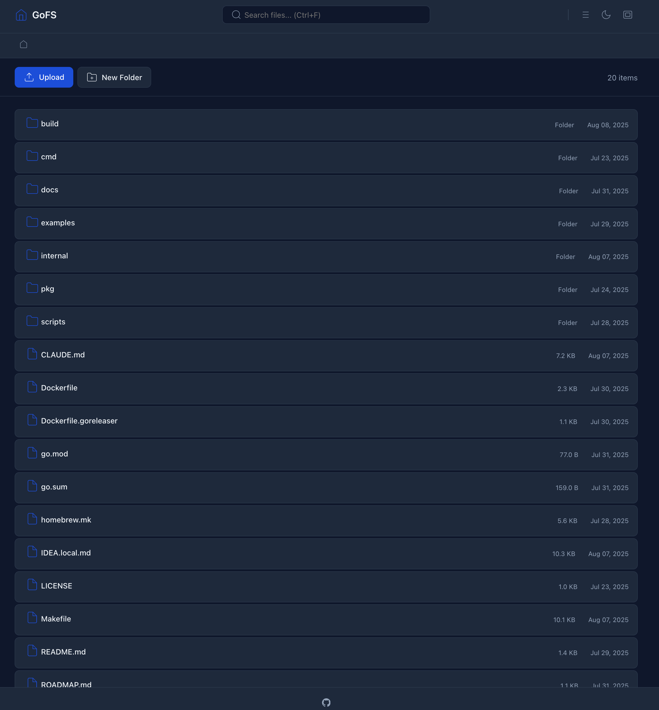

# gofs

A lightweight, fast HTTP file server written in Go.

[](https://goreportcard.com/report/github.com/samzong/gofs)
[](LICENSE)

## Features

- **Fast**: Optimized for performance with minimal overhead
- **Secure**: Safe path handling prevents directory traversal attacks, basic authentication with bcrypt password hashing
- **Simple**: Single binary, easy deployment
- **Cross-platform**: Works on Linux, macOS, Windows
- **Modern UI**: Advanced theme with upload/download capabilities
- **Structured Logging**: Production-ready logging with log/slog
- **Health Checks**: JSON-formatted health check endpoints for container orchestration

## Screenshot



## Quick Start

```bash
# Install
go install github.com/samzong/gofs/cmd/gofs@latest

# Serve current directory on port 8000
gofs

# Serve specific directory on custom port
gofs -port 3000 -dir /path/to/files

# Enable authentication
gofs -auth user:password

# Use advanced theme with upload/download UI
gofs -theme advanced
```

## Usage

```
Usage: gofs [options]

Options:
  -a, --auth string   Enable HTTP Basic Authentication with user:password format
  -d, --dir string    Root directory to serve files from (default ".")
  -h, --help          Show this help message and exit
  -H, --show-hidden   Show hidden files and directories
      --host string   Server host address to bind to (default "127.0.0.1")
  -p, --port int      Server port number to listen on (default 8000)
      --theme string  UI theme: default, classic, advanced (default "default")
  -v, --version       Show version information and exit
      --health-check  Perform health check and exit (outputs JSON)

Environment Variables:
  GOFS_PORT           Server port (default: 8000)
  GOFS_HOST           Server host (default: 127.0.0.1)
  GOFS_DIR            Root directory (default: .)
  GOFS_THEME          UI theme (default: default)
  GOFS_SHOW_HIDDEN    Show hidden files (default: false)
  GOFS_AUTH           Basic auth credentials (user:password)
  GOFS_LOG_LEVEL      Log level (debug, info, warn, error)
  GOFS_ENV            Environment mode (affects logging format)
```

## Themes

gofs includes three built-in themes:

- **default**: Minimal, fast theme for basic file browsing
- **classic**: Windows Explorer-style interface
- **advanced**: Modern UI with file upload, folder creation, and enhanced navigation

## API

The server provides both HTML and JSON responses:

- **HTML**: Default browser view with file listing
- **JSON**: Add `Accept: application/json` header for programmatic access

Example JSON response:
```json
{
  "path": "/",
  "files": [
    {
      "name": "example.txt",
      "size": 1024,
      "isDir": false,
      "modTime": "2025-08-07T10:30:00Z"
    }
  ],
  "count": 1
}
```

## Health Checks

gofs provides health check endpoints for container orchestration:

```bash
# Command line health check (outputs JSON)
gofs --health-check

# HTTP endpoints
curl http://localhost:8000/healthz
curl http://localhost:8000/readyz
```

Health check response format:
```json
{
  "status": "OK",
  "timestamp": "2025-08-07T10:30:00Z"
}
```

## Authentication

Basic HTTP authentication can be enabled via command line or environment variable:

```bash
# Via command line
gofs -auth username:password

# Via environment variable
export GOFS_AUTH=username:password
gofs
```

## Development

```bash
# Clone repository
git clone https://github.com/samzong/gofs.git
cd gofs

# Build
make build

# Run tests
make test

# Run linter
make lint

# Run with auto-fix
make lint-fix

# Generate coverage report
make test-coverage

# Build for all platforms
make build-all
```

## Requirements

- Go 1.24 or higher

## License

This project is licensed under the MIT License - see the [LICENSE](LICENSE) file for details.